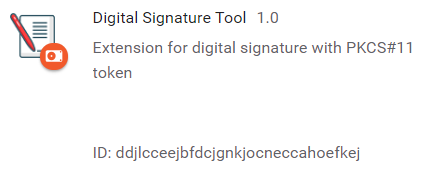

# Digital-Signature-Chrome-Extension

> **Sorry, README under construction...** :construction_worker: 

  

  
### 1. Introduction

This project aim to create an integration of digital signature, with pkcs#11 token, within Chrome browser.
The extension interact with a native application developed in java which has the purpose of directly interact with the cryptographic harware. 
The user through the extension can signing a document (PDF) openend in a browser tab.
The software support CAdES and PAdES signature (both visible and not visible type).
The app hallow to sign document  online files (the app download the document, sign it and create a new signed file) or local files.

### 2. Native application

The native application is an adapted version of my cli tool ( https://github.com/AlessioScarfone/Java-Digital-Signature ), slightly modified to communicate with a chrome extension.
The fundamental change is the adding of a middleware object that read the messages from the extension, in JSON format, and format them for adapt to command line parameters and return the response to the browser.

----

### 3. Installation

**Prerequisites:**
- Chrome Browser
- Java 8
- Token PKCS #11

**Step 1:  DOWNLOAD REQUIRED FILES**

The necessary folders of the project for the installation are: 
- **app**: it contains the extension source code and will be used as *Unpacked Extension*.
- **hostapp-dist**: it contains all file for the native application.

Create a folder that contain the folders: **app** and **hostapp-dist**.

**Step 2:  INSTALL THE CHROME EXTENSION**

- Open Chrome and  enter `chrome://extensions/` into your address bar.
- Click on the “developer mode” toggle in the upper-right corner.
- Click no "**Load Unpacked**" and select the "**app**" folder.
At this point in the extension list will appear the loaded extension.

Get copy the ID (look at the image), you will need it later..

**STEP 3: INSTALL NATIVE APP**

- Go into **hostapp-dist** filder
- open manifest.json file and modify the "allowed_origins" value with your loaded extension ID.

"allowed_origins": [
    "chrome-extension://YOUR_EXTESION_ID/"
  ]

- After this run the `install_host.bat` script that will create some registry key that are necessary for use native application.

**NOW YOU CAN USE THE APPLICATION** 

> **NOTE:** for **uninstall** the application is enough remove the extension from chrome and run `uninstall_host.bat`

### 4. Usage
**Work in progress...** :construction_worker: :computer:

<ol>
  <li>Open pdf with browser (local or online file).</li>
  <li>Click on extension icon, this will open a popup.</li>
  <li>Select the type of signature you want:</li>
  4.1. <b>CAdES or PAdES not visible </b>
  <ol> 
    <li>Insert password.</li>
    <li>The extension will download the file (if is online) and sign the pdf.</li>
  </ol>
  4.2. <b>PAdES visible signature</b>
  <ol> 
    <li>The extension will download the file (if is online) and retrieve informations about pdf, like page number and signature fields.</li>
    <li>Configure the setting for visible signature: page and position or if some fields is present, you can select the preferred field to use for signature.</li>
    <li>Go to next step and insert password and sign the pdf.</li>
  </ol>
 5. At the end of procedure you will see a confirm message or, if any problem will rise, you will see an error message.
    
</ol>

----

### 5. Project Structure

**Folder structure:**
- **app**: contains the source of the chrome extension.
- **hostapp-src**: contains the source code of the native application.
- **hostapp-dist**: contains all the files necessary for installing and running the application. 

Chrome extension gets data from browser and pass it to native application using [Chrome Native Messaging](https://developer.chrome.com/extensions/nativeMessaging). A middleware parse the received message from the browser and prepare data for the native application that will sign the document and return the data needed for the extension.

####  5.1. Chrome Extension structure
**Work in progress...** :construction_worker: :computer:

**Extension components:**
- **Popup/Page Action**: the UI of the extension, which can be activated only on the tabs that contain a pdf. Allows the user to choose the type of signatures and enter the necessary data such as password, field to sign etc.
The script is also responsible for downloading the file and injection the content script if necessary.
- **Background Script**: script that manages communication with the native app and provides storage services to restore the state of the popup and data. (Allows the user to temporarily close the popup and finish the operation later)
- **Content Script**: (used only for PAdES visible signature). The browser viewer of pdf not show names of signature fields, so this script add the name of the field "above" the pdf viewer.

> For details about Chrome Extension Architecture: https://developer.chrome.com/extensions/overview

-----

#### NOTE:
- Tested on: **Windows 10, 8.1 (Oracle JDK8).**

- **Tested with Aruba Token Usb with Italian CNS**: [Link to Aruba token page](https://www.pec.it/cns-token.aspx)

